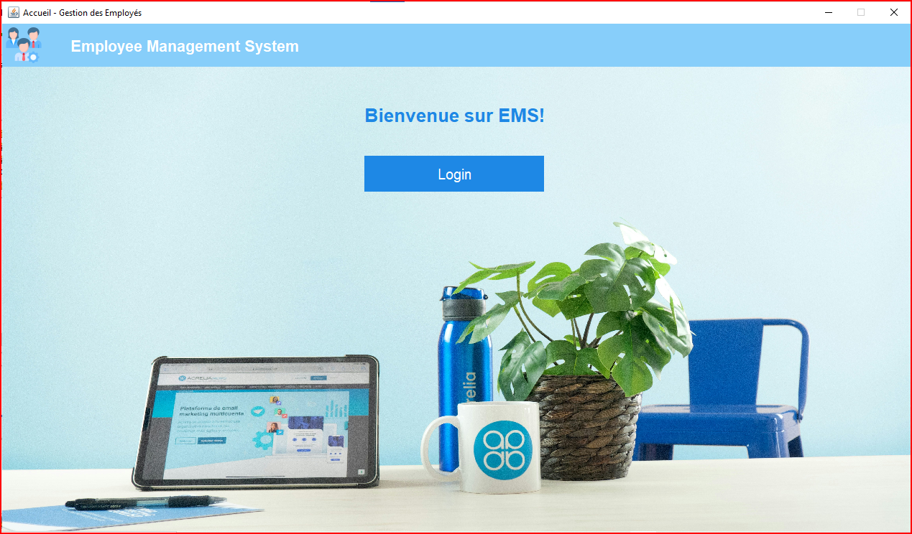
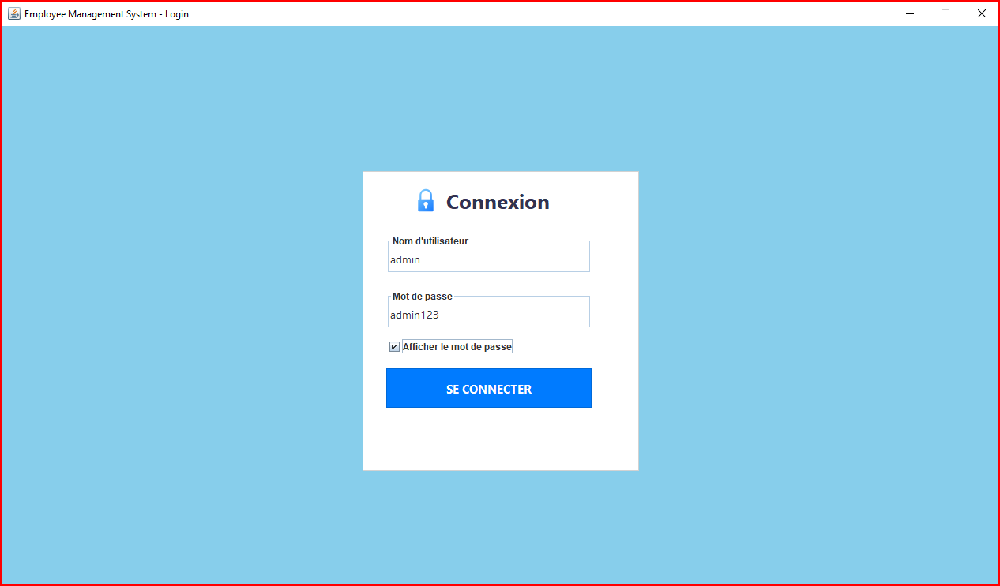
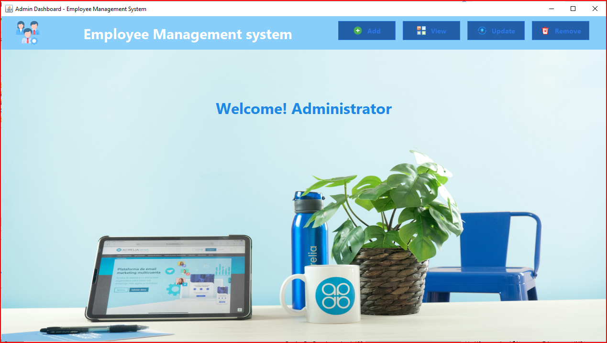

# Employee Management System

## Overview

Employee Management System is a desktop application developed in Java Swing for managing employees within an organization. The system provides an intuitive graphical interface for administrators to perform employee management operations efficiently.

## Features

* Administrator authentication
* Add new employees
* Update employee information
* Delete employees
* View employee records
* Archive employee records
* Employee search functionality
* MySQL database integration
* Modern Swing graphical interface

## Technologies Used

* Java Swing
* Java JDBC
* MySQL
* NetBeans IDE

## Project Structure

```text
src/
 ├── controller/
 ├── model/
 └── view/

database/
 └── gestionemp.sql

lib/
 ├── mysql-connector-j.jar
 ├── rs2xml.jar
 ├── jcalendar.jar
 └── flatlaf.jar
```

## Database Configuration

The application uses MySQL.

Create a database named:

```sql
CREATE DATABASE gestionemp;
```

Import the provided SQL script:

```text
database/gestionemp.sql
```

Update the connection settings in:

```java
conn.java
```

```java
DriverManager.getConnection(
    "jdbc:mysql://localhost:3306/gestionemp",
    "root",
    ""
);
```

## Installation

1. Clone the repository

```bash
git clone https://github.com/USERNAME/employee-management-system-java-swing.git
```

2. Open the project in NetBeans.

3. Add all JAR files from the `lib` folder.

4. Import the database.

5. Run the project.

## Login Credentials

Default administrator account:

```text
Username: admin
Password: admin123
```

## Author

Developed as a Java Swing desktop application for employee management.
# Les interfaces 
## Login Page



## Dashboard



## Add Employee


